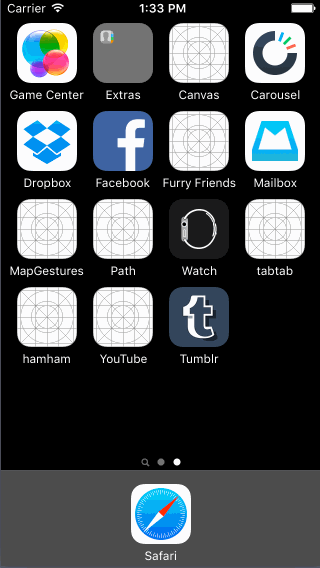

# Tumblr App

This is an iPhone demo application showing the screens of the [Tumblr iOS App](https://itunes.apple.com/us/app/tumblr/id305343404?mt=8). Built using Codepath's [Tumblr  Tutorial](http://courses.codepath.com/courses/ios_for_designers/unit/4#!assignment).

Time spent: 8 hours spent in total

Completed user stories:

* [x] Required: Tapping on Home, Search, Account, or Trending should show the respective screen and highlight the tab bar button.
* [x] Required: Compose button should modally present the compose screen.
* [x]  Optional: Compose screen is faded in while the buttons animate in.
* [x]  Optional: Login button should show animate the login form over the view controller.
* [x]  Optional: Discover bubble should bob up and down unless the SearchViewController is tapped.
* [x]  Optional: Made appropriate screens scrollable.
* [x]  Optional: Made status bar text white.

GIF created with [LiceCap](http://www.cockos.com/licecap/).
